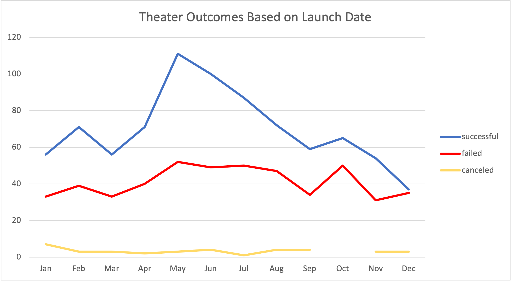

# Kickstarting with Excel

## Overview of Project
Using the Kickstarter dataset, visualize the campaign outcomes based on their launch dates and their funding goals. 

### Purpose and Background
A friend Louise’s play **Fever** came close to its fundraising goal in a short amount of time. Now, she wants to know how different campaigns fared in relation to their launch dates and their funding goals.

## Analysis and Challenges
I preformed my analysis using Excel and the dataset "Kickstarter". This information has a wide range of projects started along with the corresponding results from each project. There are multiple different categories beyond just theater plays and musicals. The data was analyzed using a variety of Excel functions and charts to understand the data provided.  

### Analysis of Outcomes Based on Launch Date

The conclusion for the worksheet "Theater Outcomes by Launch Date" implies there is a large number of new plays / musicals where the kickstarter is started in April, May and June of any given year. This could coincide with summer semesters or end of school year with graduations and in a increase of available staff to produce the play. 

### Analysis of Outcomes Based on Goals

Most smaller projects ($0.00 to $14,999) have a declining chance of success vs projects which have a smaller to larger goal have an increasing chance of failure. After goals of $15,000 fail more than the projects with the same amount. There were two notable groups ($35,000 to $39,999 & 40,000 to $44,999) where 66% of the projects were funded. 

### Challenges and Difficulties Encountered
